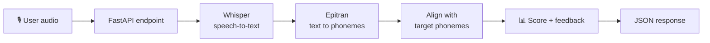
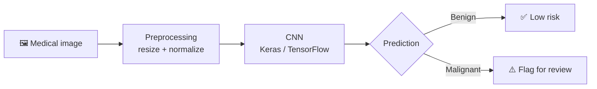

<div align="center">


<br/>

<a href="https://imapro.in"></a>
<br/>


<br/>

<a href="https://alimehdikhan.github.io/"></a>
<a href="https://linkedin.com/in/ali-mehdi-khan-b4062b2a3"></a>
<a href="mailto:ali973mehdi@gmail.com"></a>
<a href="https://github.com/alimehdikhan"></a>

<br/>


</div>

---

## 🧠 About Me

```python
class AliMehdiKhan:
    def __init__(self):
        self.role = "Junior Software Developer @ imaPRO | AI/ML Engineer"
        self.company = "imaPRO (imapro.in) — Aug 2026 to Present"
        self.location = "Lucknow, Uttar Pradesh, India"
        self.education = "B.Tech CSE, Babu Banarasi Das University (2026)"
        self.focus = ["Machine Learning", "Deep Learning", "NLP", "Full-Stack Web Development"]
        self.philosophy = "Turn research-grade models into real, usable tools"

    def open_to(self):
        return [
            "Open-source collaborations",
            "Freelance AI/ML and web projects",
            "Tech talks and knowledge sharing"
        ]
```

I'm a Computer Science graduate and a Junior Software Developer at **[imaPRO](https://imapro.in)**. I build complete systems: I train deep learning models, wrap them in Python APIs, and put a working front end on top. At imaPRO I work on web apps, APIs and internal tools for real client projects. Outside work I keep building in **AI/ML**, mostly speech, NLP and healthcare models.

<div align="center">

### 🎯 Open To


</div>

---

## 🛠️ Tech Stack

<div align="center">

**Languages**


**Frontend**


**Backend & APIs**


**Databases**


**AI / ML**


**Cloud, DevOps & Tools**


</div>

---

## 🤖 AI / ML Expertise

<div align="center">

| Domain | Proficiency | Details |
|---|:-:|---|
| **Natural Language Processing** | ⭐⭐⭐⭐ | Speech-to-text with OpenAI Whisper, phoneme-level pronunciation scoring |
| **Deep Learning** | ⭐⭐⭐⭐ | CNN-based binary classification with Keras/TensorFlow, 90%+ accuracy on medical imaging |
| **Audio Signal Processing** | ⭐⭐⭐ | Low-latency audio pipelines and feature extraction for real-time spoken feedback |
| **Generative AI** | ⭐⭐⭐ | Google Cloud Vertex AI (Gemini & Imagen), prompt design |
| **Predictive Modeling** | ⭐⭐⭐ | Supervised ML for diabetes and skin cancer prediction, feature engineering, hyperparameter tuning |
| **Model Deployment** | ⭐⭐⭐ | FastAPI inference endpoints, Hugging Face Spaces |

</div>

---

## 💼 Experience

### 🏢 Junior Software Developer — [imaPRO](https://imapro.in)
*August 2026 – Present*

- Build and maintain web applications, dashboards and internal tools for client and in-house projects
- Write backend APIs and third-party integrations in Python and JavaScript
- Work on front-end features with React and modern CSS
- Help build AI-based tools and automations used across the team

`Python` `JavaScript` `React` `Node.js` `FastAPI` `REST APIs` `SQL` `Git`

### 🎓 Machine Learning Intern — BBD University
*Lucknow, India · June 2025 – July 2025*

- Built a **skin cancer detection** model using deep learning in Python
- Built a **diabetes prediction** model using supervised learning
- Used feature engineering and hyperparameter tuning to push model accuracy up

`Python` `TensorFlow` `Keras` `Machine Learning` `Deep Learning` `Feature Engineering`

---

## 🚀 Featured Projects

<details open>
<summary><b>🗣️ AI Pronunciation Coach</b></summary>
<br/>

A pronunciation coaching app that listens to spoken English and gives feedback at the sound (phoneme) level.

| | |
|---|---|
| **Stack** | FastAPI · OpenAI Whisper · Epitran · Python |
| **Pipeline** | Real-time audio ingestion and scoring |
| **Performance** | Low-latency transcription with phoneme-level scoring |
| **Repository** | [A.I-Pronunciation-Coach](https://github.com/alimehdikhan/A.I-Pronunciation-Coach) |

**How it works**



</details>

<details>
<summary><b>🩺 Cancer Detection System</b></summary>
<br/>

A deep learning model for early-stage cancer prediction, trained on real medical imaging datasets.

| | |
|---|---|
| **Stack** | Python · TensorFlow · Keras |
| **Task** | Binary classification on medical images |
| **Performance** | 90%+ classification accuracy |
| **Repository** | [Cancer-Detection-Model](https://github.com/alimehdikhan/Cancer-Detection-Model) |

**How it works**



</details>

---

## 🏆 Achievements

<div align="center">

| Recognition | Details |
|---|---|
| 🏅 Exemplary Discipline Award | Kept 95%+ attendance across all academic terms |
| 🤝 Tech for Good — Volunteer | Taught programming to 30+ underprivileged students over 3 months |

</div>

---

## 📜 Certifications

#### ☁️ Google Cloud


#### 🟢 Deloitte


#### 🟠 freeCodeCamp


---

## 💻 Coding Profiles

<div align="center">

[](https://leetcode.com/u/alimehdii/)
[](https://geeksforgeeks.org/user/alimehdikhan)
[](https://hackerrank.com/alimehdikhan)
[](https://codechef.com/users/alimehdikhan)

</div>

---

## 📊 GitHub Analytics

<div align="center">


<br/>


</div>

---

## 🐍 Contribution Snake

<div align="center">
<picture>
  <source media="(prefers-color-scheme: dark)" srcset="https://raw.githubusercontent.com/alimehdikhan/alimehdikhan/output/github-snake-dark.svg" />
  <source media="(prefers-color-scheme: light)" srcset="https://raw.githubusercontent.com/alimehdikhan/alimehdikhan/output/github-snake.svg" />
  
</picture>
</div>

---

## 🎯 Current Focus

```yaml
current_focus:
  work:
    - Junior Software Developer @ imaPRO (imapro.in)
    - Web apps, APIs and internal tools for client projects
  learning:
    - Advanced NLP & speech processing
    - Deep learning architectures
    - Cloud AI on Google Vertex AI
  building:
    - AI Pronunciation Coach (ongoing improvements)
    - Healthcare ML models
  exploring:
    - LLM applications & prompt engineering
    - Generative AI with Gemini & Imagen
```

---

## 📫 Connect With Me

<div align="center">

[](mailto:ali973mehdi@gmail.com)
[](https://linkedin.com/in/ali-mehdi-khan-b4062b2a3)
[](https://github.com/alimehdikhan)
[](https://alimehdikhan.github.io/)

</div>

---

<div align="center">

*"Code with purpose, build with precision, learn relentlessly."*


</div>
